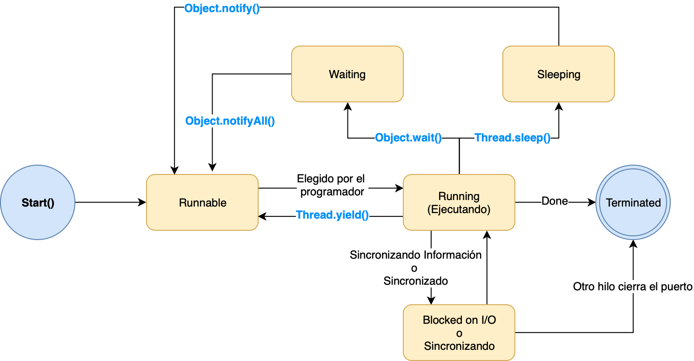

# Ejemplo de Multi-Hilos en Java

[Presentación de Multi-Hilos](https://docs.google.com/presentation/d/17d8v_SIISXmbSzzQOz8zVEr5YMDnFbYGopM00RqAFdM/edit?usp=sharing)

Multi-hilos es una técnica que permite correr concurrentemente dos o mas partes de un programa, maximizando la utilización del CPU. Cada parte es llamada *hilo*.

Hay dos formas de crear aplicaciones multi-hilos en Java:

##           Thread

### Constructores de la clase Thread

1. Thread( )
2. Thread(*String str*)
3. Thread(*Runnable r*)
4. Thread(*Runnable r*, *String str*)

### Métodos:

| Método        | **D**escripción                          |
| ------------- | ---------------------------------------- |
| setName()     | Asignarle un nombre al hilo              |
| getName()     | Obtener el nombre del hilo               |
| getPriority() | Retornar la prioridad del hilo           |
| isAlive()     | Verificar si el hilo aun esta activo     |
| join()        | Espera a que el hilo termine             |
| run()         | Punto de entrada al Hilo                 |
| sleep()       | Dormir el hilo por un tiempo definido    |
| start()       | Empezar el hilo llamando al método run() |

### Ciclo de vida del un *Thread* 



- **New:** Cuando un *thread* es creado, es un nuevo estado.
- **Runnable:** Un hilo está esperando su turno para ser elegido para su ejecución. El subprogramador selecciona el subproceso en función de las prioridades del subproceso. Los métodos `start ()` registran un hilo en un planificador de hilos.
- **Running:** El procesador está ejecutando el hilo. El hilo se ejecuta hasta que se bloquea o abandona su turno con `Thread.yield ()`. Debido a la sobrecarga del cambio de contexto, el `yield()` no debe usarse con mucha frecuencia. Los métodos `wait ()`, `sleep ()` y `join ()` hacen que el hilo deje el estado de ejecución.
- **Waiting**: Un hilo espera a que otro hilo realice una tarea.
- **Sleeping:** Los subprocesos de Java se ven obligados a dormir (suspendidos) con este método sobrecargado: `Thread.sleep (milisegundos)`, `Thread.sleep (milisegundos, nanosegundos)`.
- **Blocked on I/O:** Un subproceso se bloquea en algún procesamiento de E/S externo para finalizar. El subproceso se moverá a **Runnable** después de la condición de E / S, como leer bytes de datos.
- **Blocked on synchronization:** El subproceso se moverá a **Runnable** cuando se adquiera un bloqueo.
- **Terminated:** El hilo ha terminado su trabajo.

### Finalizar un *Thread*

Un hilo termina debido a las siguientes razones:

- El subproceso finaliza cuando el método *run ()* finaliza su ejecución.
- Cuando el hilo arroja una Excepción o Error que no está siendo atrapado en el programa.
- El programa Java se completa o finaliza.
- ~~Otro hilo llama a los métodos stop ().~~

### Formas para crear un Hilo

1. Extendiendo de la clase *Thread*
2. Implementando de la interfaz *Runnable*

## Descripción de los ejemplos

### Forma 1: Extendiendo de la clase *Thread*

#### *ExtendedExample.java*

```java
package cr.una.multithread;

public class ExtendExample extends Thread {

    public ExtendExample(String name) {
        super(name);
    }

    public void run()
    {
        try
        {
            // Displaying the thread that is running
            System.out.println ("El hilo Extend con el NOMBRE [ " +
                    getName() + " ] y con el ID [ " + Thread.currentThread().getId() +
                    " ] esta corriendo");

        }
        catch (Exception e)
        {
            // Throwing an exception
            System.out.println ("Hubo una Excepción");
        }
    }
}

```

- Este ejemplo lo que hace es mostrar en la consola el nombre del hilo y el ID en donde esta corriendo.

### Forma 2: Implementando de la interfaz *Runnable*

#### *ImplementExample.java*

```java
package cr.una.multithread;

public class ImplementExample implements Runnable {
    public String name;

    public ImplementExample(String name) {
        this.name = name;
    }

    @Override
    public void run() {
        Thread.currentThread().setName(getName());
        try
        {
            // Displaying the thread that is running
            System.out.println ("El hilo Implement con el NOMBRE [ " +
                    Thread.currentThread().getName() + " ] y con el ID [ " + Thread.currentThread().getId() +
                    " ] esta corriendo");

        }
        catch (Exception e)
        {
            // Throwing an exception
            System.out.println ("Hubo una Excepción");
        }
    }

    public String getName() {
        return name;
    }

    public void setName(String name) {
        this.name = name;
    }

}

```

- Este ejemplo lo que hace es mostrar en la consola el nombre del hilo y el ID en donde esta corriendo.

### Corriendo la aplicación

#### *ThreadMainExample.java*

```java
import cr.una.multithread.ExtendExample;
import cr.una.multithread.ImplementExample;

public class ThreadMainExample {

    static void TestExtendExample() {
        ExtendExample extendExample1 = new ExtendExample("T1");
        ExtendExample extendExample2 = new ExtendExample("T2");
        ExtendExample extendExample3 = new ExtendExample("T3");
        ExtendExample extendExample4 = new ExtendExample("T4");

        extendExample1.start();
        extendExample2.start();
        extendExample3.start();
        extendExample4.start();
    }

    static void TestImplementExample() {
        Thread implementExample1 = new Thread(new ImplementExample("T1"));
        Thread implementExample2 = new Thread(new ImplementExample("T1"));
        Thread implementExample3 = new Thread(new ImplementExample("T1"));
        Thread implementExample4 = new Thread(new ImplementExample("T1"));

        implementExample1.start();
        implementExample2.start();
        implementExample3.start();
        implementExample4.start();
    }

    // Main Class
    public static void main(String[] args)
    {
        TestExtendExample ();
    }
}
```

- Este es el archivo *main*
- Hay dos métodos que diferencian las dos formas de correr hilos.
  - Al extender simplemente se instancia la clase y se inicia con el método start();
  - Al implementar se tiene que hacer una nueva instancia de la interfaz *thread* para poder utilizar el método start();
